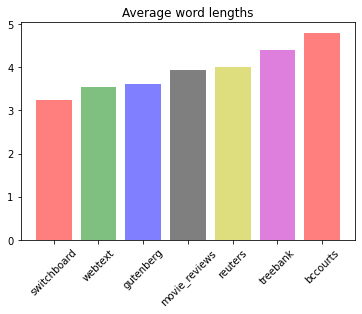
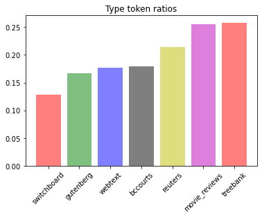

# Corpus Analysis

All the code used to generate this data is in the `copus_analysis.ipynb` file.

## Corpus basic statistics

- `Number of words` : 622868
- `Number of types` : 16178
- `TTR` : 0.18
- `Average word length` : 4.78

## Word rankings

The words are filtered from stopwords and lowercased:

1. plaintiff - 3124
2. court - 2502
3. would - 2142
4. appeal - 1891
5. evidence - 1689
6. defendant - 1674
7. judge - 1661
8. trial - 1660
9. justice - 1658
10. appellant - 1619
11. order - 1604
12. counsel - 1575
13. time - 1499
14. case - 1350
15. made - 1212
16. respondent - 1159
17. honourable - 1144
18. one - 1117
19. judgment - 1103
20. act - 1020
21. british - 1013
22. columbia - 1012
23. may - 1010
24. reasons - 999
25. application - 99

As expected, legal words dominate the ranking.

## Compraison with other corpuses

### Average word length



The `bccourts` corpus has an average word length much longer than other other corpuses. 
This might be due to long legal words dominating the corpus and maybe to the presence of names throughout the corpus.

### TTR



The TTR on the other hand is quite low, which can be expected as well, as legal words are repeatedly used throughout the corpus.

### Common words

To identify common words, ratio probabilities will be used.
The comparaison will be makde with the `switchboard` and the `treebank` corpus, to get a diversified view.

#### Switchboard

```
['act', 'columbia', 'court', 'justice', 'upon', 'evidence', 'claim', 'however', 'loss', 'reasonable', 'appeal', 'canada', 'following', 'party', 'shall', 'british', 'october', 'order', 'accident', 'therefore', 'facts', 'required', 'present', 'agreed', 'respect', 'june', 'sale', 'limited', 'received', 'sum', 'reasons', 'further', 'july', 'satisfied', 'material', 'granted', 'supreme', 'motor', 'entered', 'interest', 'action', 'apply', 'august', 'consideration', 'judge', 'trial', 'issue', 'suffered', 'clearly', 'duty']
```

The resulting words are legal words, but many of them can be interpreted differently in a different casual context (`act`, `court`). 

#### Treebank

```
['judgment', 'defendant', 'sentence', 'notice', 'entitled', 'appearing', 'accident', 'therefore', 'appropriate', 'trial', 'am', 'crown', 'sum', 'appeal', 'jurisdiction', 'circumstances', 'granted', 'pain', 'driver', 'injury', 'application', 'agree', 'respect', 'dismiss', 'wife', 'premises', 'sentencing', 'count', 'reasons', 'b', 'date', 'facts', 'insured', 'defendants', 'properly', 'maintenance', 'failure', 'present', 'proper', 'purposes', 'parties', 'argument', 'sufficient', 'property', 'residence', 'stated', 'error', 'conviction', 'vehicle', 'evidence']
```

The top words are legal words as well, but they seem to be the sort of word that would be in the context of a legal article.